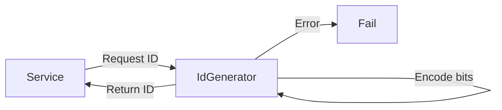

# First Principles: Why Do We Need Unique IDs?

## The Problem

In distributed systems, many services need to create **identifiers** for entities:

- **Database rows** — primary keys for users, orders, events.
- **Logs and events** — trace IDs, request IDs across services.
- **File or object storage** — blob IDs, partition keys.
- **Messages** — deduplication, ordering.

If two nodes (or two threads) generate an ID at the same time, they must **never** produce the same value. Using a single database or a single "ID service" for every ID can become a bottleneck, so we often want **distributed generation** with little or no coordination.

## What We Need From an ID

| Requirement | Meaning |
|-------------|--------|
| **Uniqueness** | No two valid IDs are the same (within the scope we care about). |
| **Ordering** (optional) | IDs sort in time order — useful for indexes, time-based partitioning, debugging. |
| **No central bottleneck** | Ideally no single server or DB write per ID. |
| **Roughly sortable** | Even if not strictly monotonic, "roughly increasing over time" helps (e.g. B-tree friendly). |
| **Size** | Fixed width (e.g. 64 bits) so it fits in DBs, URLs, and indexes. |

## Allow vs Deny (or Generate vs Fail)

Unlike a rate limiter, an ID generator doesn’t "allow or deny" a request — it **produces** a value or **fails** (e.g. clock went backwards, sequence exhausted). So the interface is:

- **Success:** return a new unique ID.
- **Failure:** raise an exception or return an error (e.g. clock skew, sequence overflow).

High-level flow:

Next: [02-design-approaches.md](02-design-approaches.md) — different ways to generate such IDs and their trade-offs.
