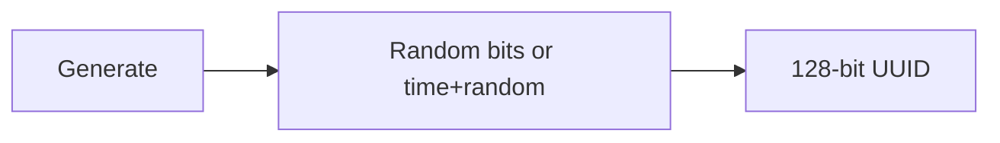
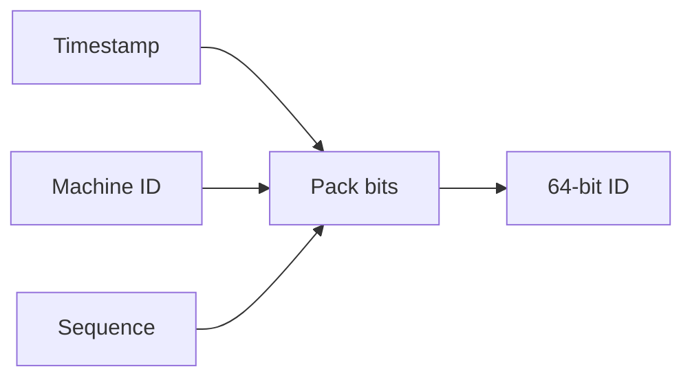

# ID Generator: Design Approaches

This document outlines common approaches and their trade-offs. No code — just concepts.

---

## 1. UUID (e.g. UUIDv4)

**Idea:** 128 bits, random (v4) or time-based (v7). No coordination; each node generates independently.

- **Uniqueness:** Very high probability (random bits or time + random).
- **Ordering:** v4 — no ordering; v7 — time-ordered first 48 bits, rest random.
- **Pros:** Simple, no state, no clock sync. **Cons:** Large (128 bits), v4 not sortable, v7 needs careful spec.

---

## 2. Snowflake-style (timestamp + machine + sequence)

**Idea:** One 64-bit number built from: **timestamp** (ms since epoch) + **machine/worker ID** + **sequence** (counter within the same millisecond). Single node keeps a counter per "tick"; multiple nodes use different machine IDs.

- **Uniqueness:** Same machine + same ms → sequence is unique; different machines → different machine bits.
- **Ordering:** IDs increase over time (timestamp is leading bits).
- **Pros:** 64-bit, sortable, no DB. **Cons:** Need to assign machine IDs; clock must not go backwards (or handle it).

Typical bit layout (example): 41 bits timestamp (ms), 10 bits machine, 12 bits sequence.

---

## 3. Segment / range from database

**Idea:** One service (or DB) allocates **ranges** of IDs (e.g. 1–1000, 1001–2000). Each node gets a range and hands out IDs from it until exhausted, then fetches the next range.

- **Uniqueness:** Central authority assigns non-overlapping ranges.
- **Ordering:** Monotonic within a range; ranges are ordered.
- **Pros:** Strong guarantees, simple logic per node. **Cons:** Depends on DB or central service; more latency when refilling.

---

## Comparison

| Approach      | Size   | Ordering     | Coordination     | Complexity |
|---------------|--------|-------------|------------------|------------|
| UUID v4       | 128-bit| No          | None             | Low        |
| UUID v7       | 128-bit| Time-based  | None             | Medium     |
| Snowflake     | 64-bit | Yes         | Machine ID assign| Medium     |
| Segment/range | 64-bit | Yes         | DB or service    | Higher     |

---

## What to Implement First

A practical path is to implement a **Snowflake-style** generator first:

1. Single-node version (machine ID = 0 or configurable).
2. Bits: timestamp (ms) + machine ID + sequence; pack into one 64-bit integer.
3. Handle "same millisecond": increment sequence; if sequence overflows, wait or advance logical "tick".
4. Handle clock going backwards: reject or wait (document the choice).

Then you can add a simple **UUIDv4** wrapper (use standard library) and document when to use which.

Next: [03-implementation-steps.md](03-implementation-steps.md) — step-by-step flow and where to put logic in code.
