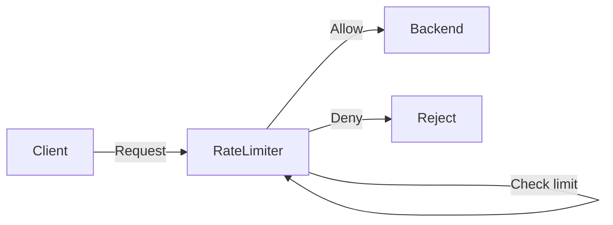

# First Principles: What Is Rate Limiting?

## The Problem

Systems need to handle many clients. Without limits, a single client (or attacker) can:

- **Abuse** a service (e.g. scraping, credential stuffing).
- **Starve** others by consuming all capacity (no fair usage).
- **Overwhelm** backends and cause outages.

**Rate limiting** is a mechanism to cap how many requests (or operations) a given client can make in a defined period. Requests over the limit are rejected so the system stays stable and fair.

## Core Concepts

| Concept | Meaning |
|--------|---------|
| **Limit** | Maximum number of requests allowed in a period (e.g. 100 per minute). |
| **Window** | The time period over which we count (e.g. 60 seconds). It can be *fixed* (aligned to clock) or *sliding* (last N seconds from now). |
| **Identifier** | Who we are limiting: e.g. user ID, API key, IP address. Each identifier has its own counter or state. |

## Allow vs Deny

For each incoming request we:

1. **Identify** the client (e.g. by IP or user ID).
2. **Check** whether allowing this request would exceed the limit for that identifier in the current (or sliding) window.
3. **Allow** the request (and update state) if under the limit; otherwise **deny** (and optionally return 429 or raise an exception).

High-level flow:

So: **allow** = under limit, **deny** = over limit. The next document covers *how* we count and check (the algorithms).
