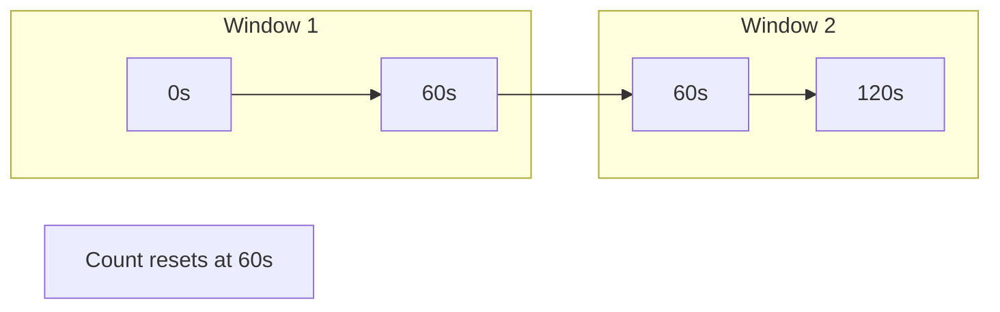
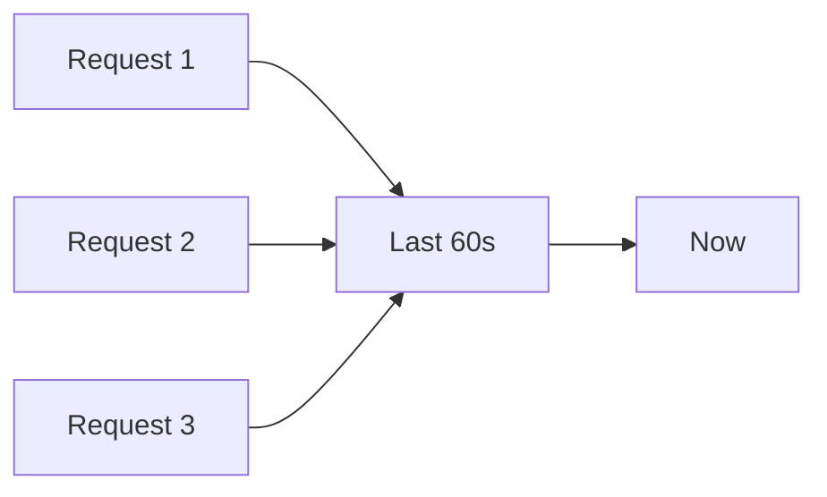
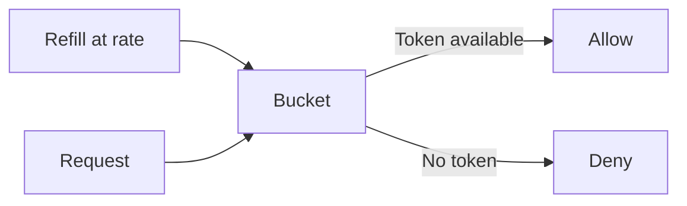

# Rate Limiting Algorithms Overview

This document compares the main algorithms and sketches their behavior with diagrams. No code—just concepts and trade-offs.

## Fixed Window

We divide time into fixed intervals (e.g. minute 0–60s, 60–120s). For each identifier we keep a **counter** for the current interval. When a request arrives, if we're still in the same interval and count is below the limit, we allow and increment; otherwise we deny. When a new interval starts, we reset the counter.

**Pros:** Simple, low memory (one counter per key). **Cons:** Bursts at window boundaries (e.g. 100 at 59s and 100 at 61s = 200 in 2 seconds).

---

## Sliding Window

The “window” is the **last N seconds** from *now*, not a fixed calendar interval. So the limit applies to “how many requests in the last 60 seconds” at any moment.

**Sliding window log:** Store timestamps of requests; drop those older than the window; allow if the number of remaining timestamps is below the limit.

**Pros:** Accurate, no boundary burst. **Cons:** More memory (list of timestamps per key) and work to trim old entries.

---

## Token Bucket

We maintain a **bucket** of tokens per identifier. The bucket has a **capacity** (max tokens). Tokens are **added at a fixed rate** (e.g. 10 per second). Each request **consumes one token**; if no token is available, we deny.

**Pros:** Allows controlled bursts (up to capacity), smooths traffic over time. **Cons:** Different semantics than “max N requests per window” (it’s a rate + burst cap).

---

## Leaky Bucket (optional)

Requests are processed at a **constant rate** (like water leaking out of a bucket). Excess requests wait or are dropped. Good for smoothing traffic to a fixed output rate; we do not implement it in the initial scope.

---

## Comparison

| Algorithm       | Simplicity | Burst at boundary | Memory     | Accuracy     |
|----------------|------------|--------------------|------------|-------------|
| Fixed window   | High       | Yes                | Low        | Coarse      |
| Sliding window | Medium     | No                 | Higher     | High        |
| Token bucket   | Medium     | Configurable       | Low        | Rate-based  |

Next: [03-implementation-steps.md](03-implementation-steps.md) ties these to the code and step-by-step flow.
