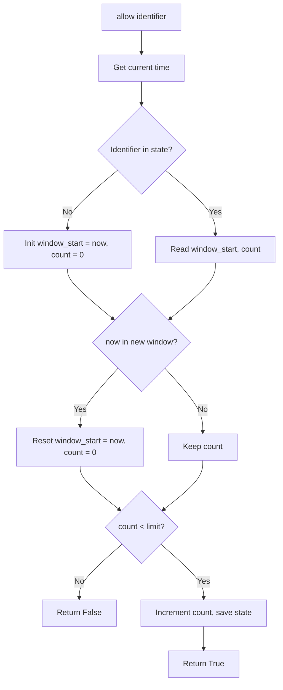
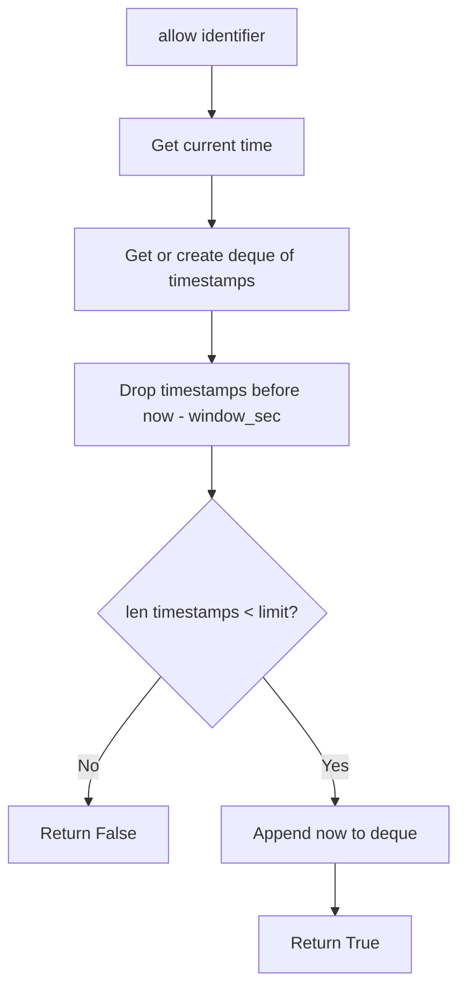
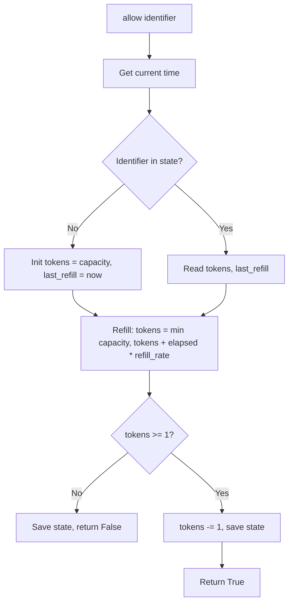

# Implementation Steps

This document maps the algorithms to the code and describes the flow for each limiter. Read in order: Step 1 → 2 → 3.

---

## Step 1: Base and Exceptions

**Files:** [rate_limiter/exceptions.py](../rate_limiter/exceptions.py), [rate_limiter/base.py](../rate_limiter/base.py)

- **exceptions.py:** Defines `RateLimitExceeded(identifier, message)`. Raised when a request is rejected.
- **base.py:** Defines the abstract `RateLimiter` with:
  - `allow(identifier: str) -> bool`: returns `True` if allowed, `False` if rate limited.
  - `raise_if_not_allowed(identifier)`: calls `allow` and raises `RateLimitExceeded` if `False`.

All concrete limiters implement `allow(identifier)`.

---

## Step 2: Fixed-Window Counter

**File:** [rate_limiter/fixed_window.py](../rate_limiter/fixed_window.py)  
**Class:** `FixedWindowLimiter(limit, window_sec, time_func=None)`

**Algorithm in words:** One counter per identifier. The window is a fixed interval (e.g. 60 seconds). If the current time has moved into a new window, reset the counter. If count is below the limit, allow and increment; otherwise deny.

**Flow:**

**State:** `identifier -> (window_start, count)`. New window when `now >= window_start + window_sec`.

---

## Step 3: Sliding-Window Log

**File:** [rate_limiter/sliding_window.py](../rate_limiter/sliding_window.py)  
**Class:** `SlidingWindowLimiter(limit, window_sec, time_func=None)`

**Algorithm in words:** For each identifier, keep a list (deque) of request timestamps. On each request: remove timestamps older than `now - window_sec`; if the number of remaining timestamps is below the limit, allow and append `now`; otherwise deny.

**Flow:**

**State:** `identifier -> deque([t1, t2, ...])`. The “window” is the last `window_sec` seconds from now.

---

## Step 4: Token Bucket

**File:** [rate_limiter/token_bucket.py](../rate_limiter/token_bucket.py)  
**Class:** `TokenBucketLimiter(capacity, refill_rate, time_func=None)`

**Algorithm in words:** Per identifier we store `(tokens, last_refill_time)`. On each request: refill tokens by `elapsed * refill_rate` (capped at capacity), then if at least one token, deduct one and allow; otherwise deny.

**Flow:**

**State:** `identifier -> (tokens, last_refill_time)`. Tokens are refilled continuously by time elapsed since `last_refill_time`.

---

## Reading Order

1. [01-first-principles.md](01-first-principles.md) — what and why  
2. [02-algorithms-overview.md](02-algorithms-overview.md) — algorithms and trade-offs  
3. This file — how each step maps to code and the `allow()` flow

Then read the source in the same order: `base.py` → `fixed_window.py` → `sliding_window.py` → `token_bucket.py`.
